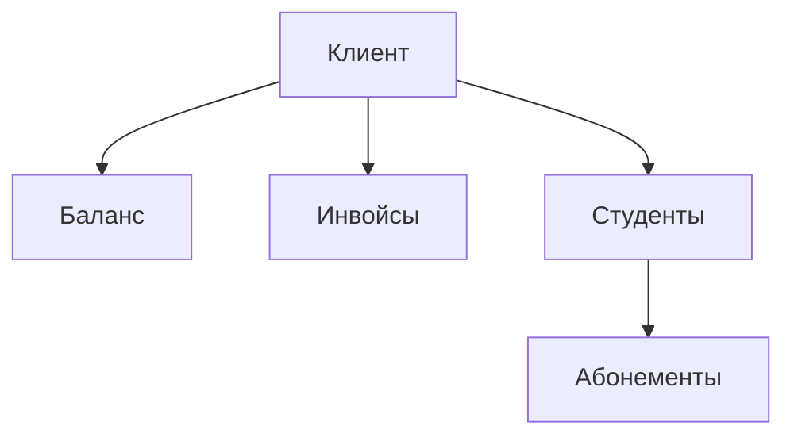

# Финансовая система

## Основные сущности

### Клиент

#### Реализация
Клиенты определены в [`app/models/client.py`](../../app/models/client.py)

#### Атрибуты
- ID клиента
- Персональные данные
- Текущий баланс
- Список привязанных студентов
- История платежей
- История инвойсов

### Студент
#### Реализация
Студенты определены в [`app/models/student.py`](../../app/models/student.py)

#### Атрибуты
- ID студента
- Привязка к клиенту
- Активные абонементы
- История тренировок

### Инвойс
#### Реализация
Инвойсы определены в [`app/models/invoice.py`](../../app/models/invoice.py)

#### Атрибуты
- ID инвойса
- Клиент
- Сумма
- Дата создания
- Статус (новый/оплачен/отменен)
- Описание
- Создатель (админ/тренер)

### Платеж
#### Реализация
Платежи определены в [`app/models/payment.py`](../../app/models/payment.py)

#### Атрибуты
- ID платежа
- Клиент
- Сумма
- Дата платежа
- Тип платежа (наличные/карта/перевод)
- Статус (проведен/отменен)
- Регистратор платежа (админ/тренер)

### Абонемент
#### Реализация
Абонементы определены в [`app/models/subscription.py`](../../app/models/subscription.py)

#### Атрибуты
- ID абонемента
- Студент
- Тип абонемента
- Дата начала
- Дата окончания
- Статус (активный/завершен/отменен)
- Количество оставшихся занятий (если применимо)

## Бизнес-процессы

### Регистрация платежа
1. Админ/тренер создает платеж
2. Система проверяет корректность данных
3. Система увеличивает баланс клиента
4. Система создает запись в истории платежей

### Создание инвойса
1. Админ/тренер создает инвойс
2. Система привязывает инвойс к клиенту
3. Система проверяет баланс клиента
4. При достаточном балансе - автоматическое погашение

### Погашение инвойса
1. Автоматически при достаточном балансе
2. Система уменьшает баланс клиента
3. Система обновляет статус инвойса
4. Создается запись в истории операций

### Отмена операций
#### Отмена платежа
1. Админ инициирует отмену платежа
2. Система проверяет возможность отмены
3. Система корректирует баланс клиента
4. Система обновляет статус платежа

#### Отмена погашения инвойса
1. Админ инициирует отмену погашения
2. Система проверяет возможность отмены
3. Система возвращает средства на баланс
4. Система обновляет статус инвойса

### Управление абонементами
1. Админ создает абонемент для студента
2. Система проверяет наличие оплаченного инвойса
3. Система активирует абонемент
4. Система начинает отслеживание использования

## Правила и ограничения

### Платежи
- Могут регистрировать как админы, так и тренеры
- Отменять платежи может только админ
- Каждый платеж должен иметь тип и описание
- История платежей неизменна (только отмена)

### Инвойсы
- Создаются админами и тренерами
- Автоматически погашаются при наличии баланса
- Отмена погашения только админом
- Привязаны к конкретному клиенту

### Абонементы
- Создаются только после оплаты
- Привязаны к конкретному студенту
- Могут иметь ограничение по времени/количеству занятий
- Отмена или изменение только админом

### Баланс клиента
- Пополняется через платежи
- Расходуется на погашение инвойсов
- Не может быть отрицательным
- История изменений сохраняется

## API Endpoints
- [Управление платежами](../../technical/api/payments.md)
- [Управление инвойсами](../../technical/api/invoices.md)
- [Управление абонементами](../../technical/api/subscriptions.md) 