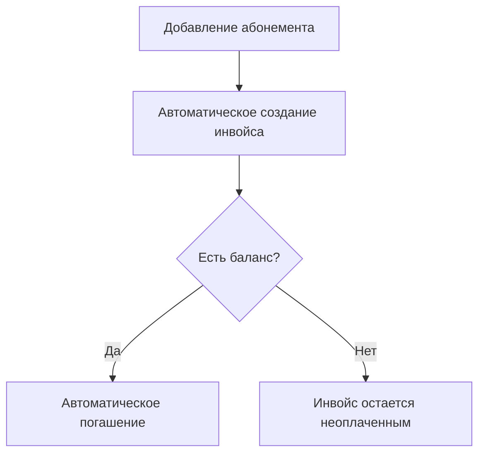
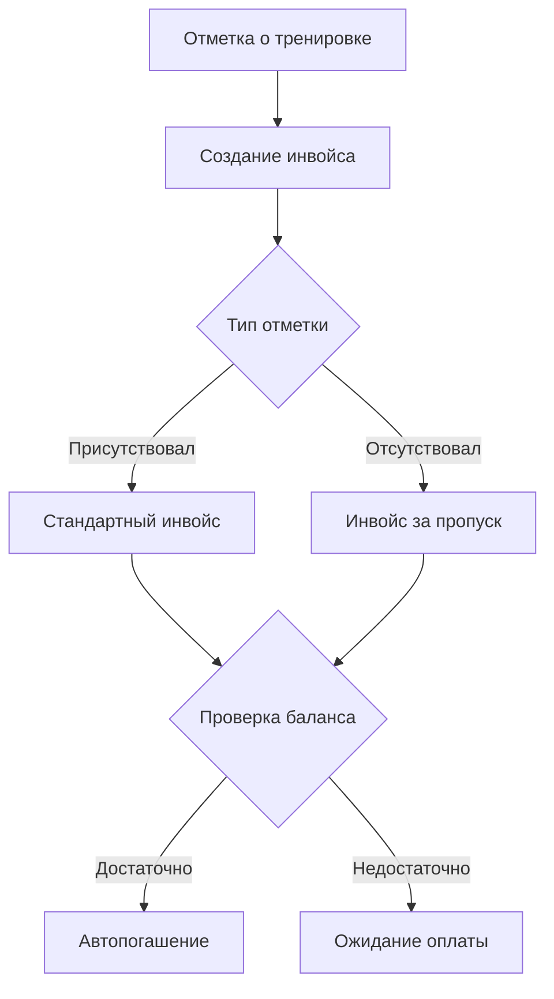
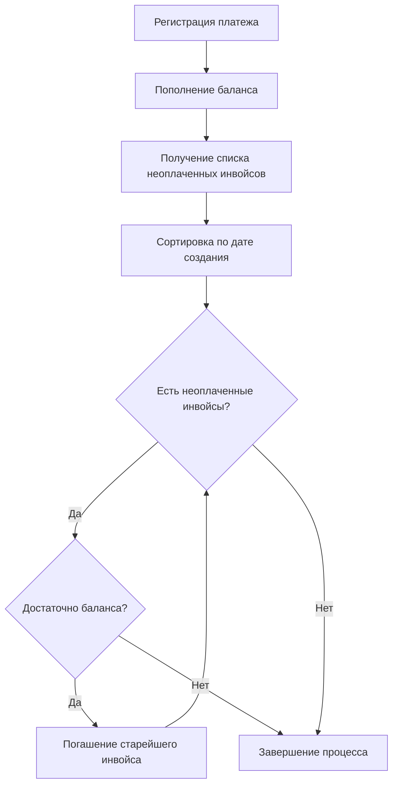
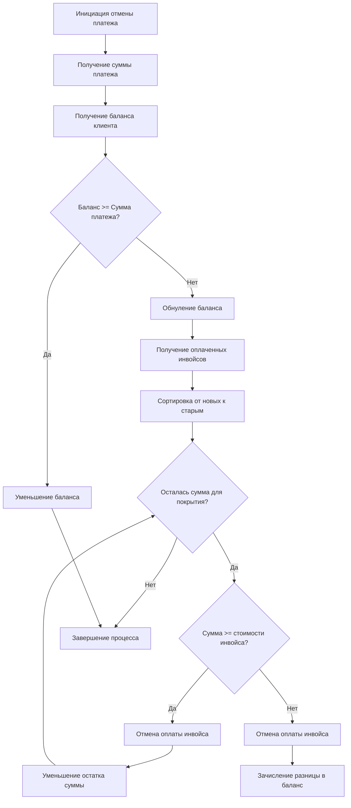
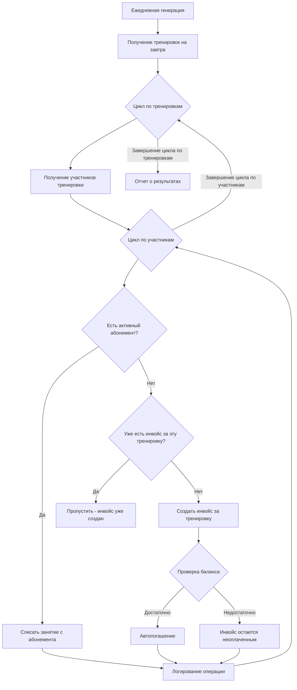
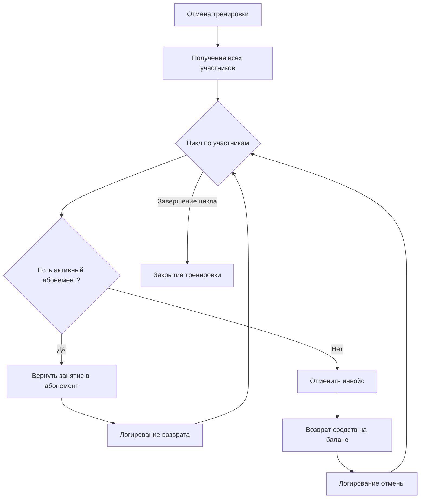

# Автоматические финансовые процессы

## Триггеры создания инвойсов

### 1. Добавление абонемента


#### Процесс
1. Тренер/админ добавляет абонемент студенту
2. Система автоматически создает инвойс
3. Проверяется баланс клиента
4. При достаточном балансе - автоматическое погашение
5. При недостаточном балансе - инвойс остается неоплаченным

### 2. Отметка о посещении/пропуске тренировки


#### Процесс
1. Тренер отмечает присутствие/отсутствие
2. Система создает инвойс независимо от типа отметки
3. Проверяется баланс клиента
4. При достаточном балансе - автоматическое погашение
5. При недостаточном балансе - инвойс остается неоплаченным

## Процесс погашения инвойсов

### Автоматическое погашение при пополнении баланса


#### Процесс
1. Регистрация платежа
2. Мгновенное пополнение баланса клиента
3. Получение списка всех неоплаченных инвойсов клиента
4. Сортировка инвойсов по дате создания (от старых к новым)
5. Последовательное погашение инвойсов пока:
   - Есть неоплаченные инвойсы
   - Достаточно средств на балансе

## Процесс отмены платежей

### Общий принцип отмены
- При обнаружении ошибки в платеже необходимо его полностью отменить
- После отмены вносится новый корректный платеж
- Частичная отмена платежа не допускается

### Алгоритм отмены платежа


#### Процесс отмены
1. Администратор инициирует отмену платежа
2. Система получает сумму отменяемого платежа и баланс клиента
3. Сравнивается баланс с суммой платежа:
   - Если баланс >= сумма платежа: просто уменьшаем баланс и завершаем процесс
   - Если баланс < сумма платежа: зануляем баланс и продолжаем процесс
4. Формируется список оплаченных инвойсов в обратном порядке (от новых к старым)
5. Для каждого инвойса:
   - Если остаточная сумма >= стоимость инвойса:
     * Отменяется оплата инвойса
     * Остаточная сумма уменьшается на стоимость инвойса
   - Если остаточная сумма < стоимость инвойса:
     * Отменяется оплата инвойса
     * Разница зачисляется в баланс клиента
     * Процесс завершается

### Пример процесса отмены с достаточным балансом
```
Исходные данные:
- Платеж на 5000р
- Текущий баланс клиента: 7000р

Процесс отмены:
1. Проверка баланса: 7000р >= 5000р
2. Уменьшение баланса на 5000р
3. Новый баланс: 2000р
4. Оплаченные инвойсы не затрагиваются
```

### Пример процесса отмены с недостаточным балансом
```
Исходные данные:
- Платеж на 5000р
- Текущий баланс клиента: 2000р
- Оплаченные инвойсы (от новых к старым):
  * Инвойс 1: 2000р
  * Инвойс 2: 2000р
  * Инвойс 3: 500р

Процесс отмены:
1. Проверка баланса: 2000р < 5000р
2. Обнуление баланса
3. Остаточная сумма: 3000р (5000р - 2000р)
4. Отмена Инвойса 1 (2000р)
   Остаточная сумма: 1000р
5. Отмена Инвойса 2 (2000р)
   Поскольку остаточная сумма (1000р) < стоимость инвойса (2000р):
   - Инвойс полностью отменяется
   - Разница (1000р) зачисляется в баланс
6. Новый баланс: 1000р
```

### Правила и ограничения отмены

#### Права доступа
- Отмена платежей доступна только администраторам
- Система протоколирует все действия по отмене
- Требуется указание причины отмены

#### Ограничения процесса
- Нельзя отменить часть платежа
- Если баланс достаточный, инвойсы не затрагиваются
- При недостаточном балансе отмена идет от новых инвойсов к старым
- При невозможности отменить инвойс целиком, остаток идет в баланс

#### Технические аспекты
- Процесс отмены выполняется в одной транзакции
- Все этапы отмены логируются
- Система создает уведомления о каждом этапе
- История операций сохраняется для аудита

### Последствия отмены

#### Для инвойсов
- Инвойсы возвращаются в статус "Неоплачен"
- Сохраняется история оплаты и отмены
- Инвойсы могут быть оплачены повторно

#### Для баланса
- При достаточном балансе - просто уменьшение
- При недостаточном балансе - обнуление и возможное пополнение остатка
- Система пересчитывает доступные средства

#### Для отчетности
- Отмененные операции помечаются в отчетах
- Создаются корректировочные документы
- Обновляется финансовая статистика

## Правила и ограничения

### Создание инвойсов
- Инвойсы создаются автоматически системой
- Каждый инвойс привязан к конкретному событию (абонемент/тренировка)
- Система всегда пытается погасить инвойс сразу после создания

### Погашение инвойсов
- Строгий порядок погашения: от старых к новым
- Частичное погашение инвойсов не допускается
- Погашение происходит автоматически при достаточном балансе

### Платежи
- Моментальное пополнение баланса
- Автоматический запуск процесса погашения инвойсов
- Сохранение истории операций

## Генерация инвойсов наперед

### 3. Автоматическая генерация инвойсов за предстоящие тренировки


#### Процесс
1. **Триггер**: Процесс запускается автоматически раз в сутки (рекомендуется вечером в 21:00)
2. **Получение данных**: Система запрашивает все тренировки на следующий день
3. **Итерация по тренировкам**: Для каждой тренировки выполняются следующие шаги
4. **Получение участников**: Извлекаются все участники тренировки
5. **Проверка абонементов**: Для каждого участника проверяется наличие активного абонемента
6. **Обработка по типу покрытия**:
   - **С абонементом**: Списать занятие с абонемента
   - **Без абонемента**: Создать инвойс за тренировку
7. **Автопогашение**: Система пытается погасить инвойс автоматически
8. **Логирование**: Все операции записываются в лог

### Возможные кейсы и их обработка

#### Кейс 1: Студент с активным абонементом
```
Условие: У студента есть активный абонемент с sessions_left > 0
Действие: Списать 1 занятие с абонемента (sessions_left -= 1)
Логика: Студент использует предоплаченное занятие
```

#### Кейс 2: Студент без абонемента
```
Условие: У студента нет активного абонемента
Действие: Создать инвойс за тренировку
Логика: Студент должен оплатить разовое посещение
```

#### Кейс 3: Студент с истекшим абонементом
```
Условие: У студента есть абонемент, но sessions_left = 0 или end_date < дата_тренировки
Действие: Создать инвойс за тренировку
Логика: Абонемент не покрывает данную тренировку
```

#### Кейс 4: Студент с замороженным абонементом
```
Условие: У студента есть абонемент, но он заморожен (freeze_start_date и freeze_end_date установлены)
Действие: Создать инвойс за тренировку
Логика: Замороженный абонемент не покрывает тренировки
```

#### Кейс 5: Дублирование инвойсов
```
Условие: Инвойс за эту тренировку уже существует
Действие: Пропустить - не создавать дубликат
Логика: Избежание двойного выставления счета
```

#### Кейс 6: Отмененная тренировка
```
Условие: Тренировка была отменена
Действие: Пропустить - не создавать инвойсы и не списывать занятия
Логика: За отмененные тренировки не выставляются счета
```

#### Кейс 7: Студент с безопасной отменой
```
Условие: Студент отменил участие безопасно (>12 часов до тренировки)
Действие: Пропустить - не создавать инвойс и не списывать занятие
Логика: Безопасная отмена не влечет финансовых последствий
```

#### Кейс 8: Студент со штрафной отменой
```
Условие: Студент отменил участие с нарушением правил (<12 часов до тренировки)
Действие: 
- Если есть абонемент: списать занятие как штраф
- Если нет абонемента: создать штрафной инвойс
Логика: Штрафная отмена влечет финансовые последствия
```

### Обработка отмен тренировок

#### Полная отмена тренировки


#### Процесс отмены тренировки
1. **Получение участников**: Все студенты, записанные на тренировку
2. **Обработка каждого участника**:
   - **С абонементом**: Вернуть занятие в абонемент (sessions_left += 1)
   - **Без абонемента**: Отменить инвойс и вернуть средства на баланс
3. **Логирование**: Записать все операции в лог

### Обработка отмен участия студентов

#### Безопасная отмена (>12 часов)
```
Условие: Студент отменил участие за 12+ часов до тренировки
Действие: 
- Если есть абонемент: вернуть занятие в абонемент
- Если нет абонемента: отменить инвойс и вернуть средства
Логика: Безопасная отмена не влечет штрафов
```

#### Штрафная отмена (<12 часов)
```
Условие: Студент отменил участие менее чем за 12 часов до тренировки
Действие:
- Если есть абонемент: списать занятие как штраф (не возвращать)
- Если нет абонемента: оставить инвойс (не отменять)
Логика: Штрафная отмена влечет финансовые последствия
```

### Правила и ограничения

#### Временные ограничения
- Процесс запускается раз в сутки (рекомендуется в 21:00)
- Обрабатываются только тренировки на следующий день
- Тренировки за текущий день не обрабатываются

#### Бизнес-правила
- Инвойс создается только один раз за тренировку
- Студенты с активными абонементами используют занятия с абонемента
- Замороженные и истекшие абонементы не покрывают тренировки
- Отмененные тренировки не генерируют инвойсы и не списывают занятия
- Безопасная отмена (>12 часов) возвращает занятия/отменяет инвойсы
- Штрафная отмена (<12 часов) влечет финансовые последствия

#### Технические ограничения
- Процесс выполняется в транзакции для каждой тренировки
- При ошибке создания инвойса процесс продолжается для других участников
- Все операции логируются с указанием причины
- Связь между инвойсами и тренировками через student_id и training_id

### Примеры сценариев

#### Сценарий 1: Обычная тренировка
```
Тренировка: Йога, 16.01.2024, 10:00
Участники:
- Студент A: активный абонемент (8→7 тренировок) → Списать занятие
- Студент B: нет абонемента → Создать инвойс 2000р
- Студент C: истекший абонемент → Создать инвойс 2000р

Результат: 1 занятие списано, 2 инвойса создано
```

#### Сценарий 2: Отмена тренировки
```
Тренировка: Пилатес, 16.01.2024, 11:00 (отменена)
Участники:
- Студент A: активный абонемент (7→8 тренировок) → Вернуть занятие
- Студент B: нет абонемента → Отменить инвойс, вернуть 2000р

Результат: 1 занятие возвращено, 1 инвойс отменен
```

#### Сценарий 3: Безопасная отмена участия
```
Студент A отменяет участие за 15 часов до тренировки
- Есть абонемент: вернуть занятие (7→8 тренировок)
- Нет абонемента: отменить инвойс, вернуть средства

Результат: Финансовых последствий нет
```

#### Сценарий 4: Штрафная отмена участия
```
Студент B отменяет участие за 2 часа до тренировки
- Есть абонемент: списать занятие как штраф (7→6 тренировок)
- Нет абонемента: оставить инвойс (штраф)

Результат: Финансовые последствия применяются
```

### Мониторинг и отчетность

#### Метрики процесса
- Количество обработанных тренировок
- Количество списанных занятий с абонементов
- Количество созданных инвойсов
- Количество отмененных инвойсов
- Количество возвращенных занятий
- Время выполнения процесса
- Количество ошибок

#### Уведомления
- Отчет о результатах выполнения
- Уведомления об ошибках
- Предупреждения о необычных ситуациях
- Уведомления о штрафных отменах

#### Логирование
- Детальные логи для каждой тренировки
- Логи для каждого участника с указанием решения
- Логи отмен с указанием типа (безопасная/штрафная)
- Логи ошибок с контекстом
- Статистика по типам решений

## Технические требования

### Атомарность операций
- Создание инвойса и проверка баланса - одна транзакция
- Погашение инвойса и списание средств - одна транзакция
- Пополнение баланса и погашение инвойсов - одна транзакция
- Обработка одной тренировки - одна транзакция

### Очередность операций
- Строгая последовательность обработки платежей
- Гарантированная очередность погашения инвойсов
- Логирование всех этапов процесса
- Обработка тренировок в хронологическом порядке

### Обработка ошибок
- Откат транзакций при ошибках
- Сохранение состояния до и после операций
- Уведомление администраторов о проблемах
- Продолжение процесса при ошибках отдельных участников 