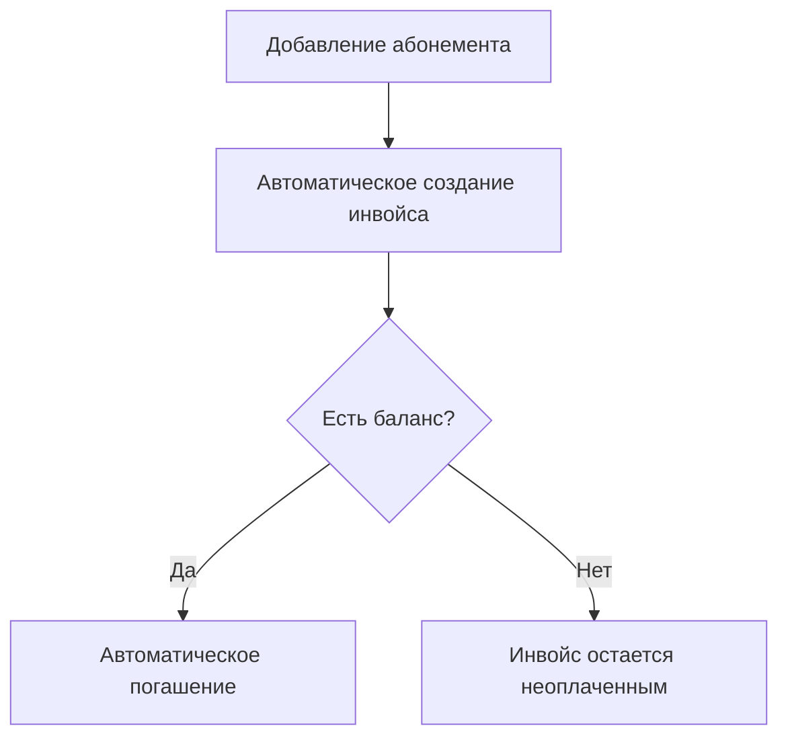
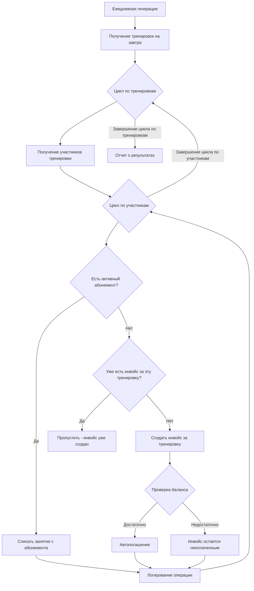
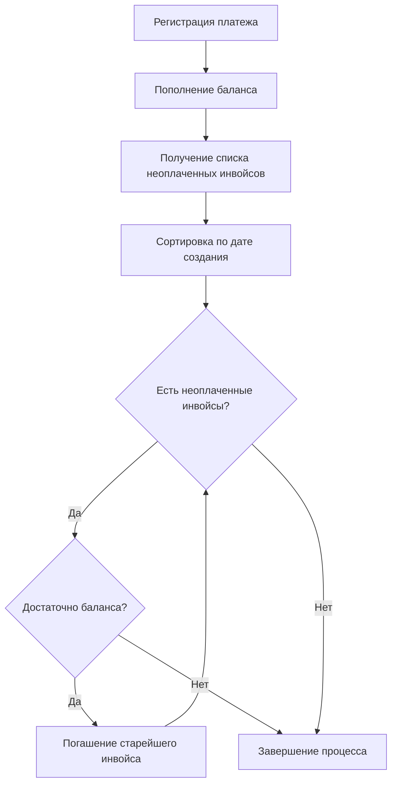
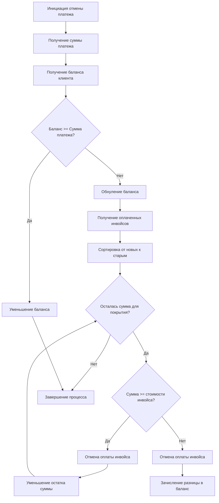

# Автоматические финансовые процессы

## Триггеры создания инвойсов

### 1. Добавление абонемента


#### Процесс
1. Тренер/админ добавляет абонемент студенту
2. Система автоматически создает инвойс
3. Проверяется баланс клиента
4. При достаточном балансе - автоматическое погашение
5. При недостаточном балансе - инвойс остается неоплаченным

### 2. Автоматическая генерация инвойсов за предстоящие тренировки


#### Процесс
1. **Триггер**: Процесс запускается автоматически раз в сутки (рекомендуется вечером в 21:00)
2. **Получение данных**: Система запрашивает все тренировки на следующий день
3. **Итерация по тренировкам**: Для каждой тренировки выполняются следующие шаги
4. **Получение участников**: Извлекаются все участники тренировки
5. **Проверка абонементов**: Для каждого участника проверяется наличие активного абонемента
6. **Обработка по типу покрытия**:
   - **С абонементом**: Списать занятие с абонемента
   - **Без абонемента**: Создать инвойс за тренировку
7. **Автопогашение**: Система пытается погасить инвойс автоматически
8. **Логирование**: Все операции записываются в лог

### Примечание об отметке посещаемости
Отметка посещаемости (PRESENT/ABSENT) не создает новые инвойсы, так как они уже созданы заранее при генерации тренировок. Статус посещаемости используется только для фиксации факта присутствия/отсутствия студента на тренировке.

## Процесс погашения инвойсов

### Автоматическое погашение при пополнении баланса


#### Процесс
1. Регистрация платежа
2. Мгновенное пополнение баланса клиента
3. Получение списка всех неоплаченных инвойсов клиента
4. Сортировка инвойсов по дате создания (от старых к новым)
5. Последовательное погашение инвойсов пока:
   - Есть неоплаченные инвойсы
   - Достаточно средств на балансе

## Процесс отмены платежей

### Общий принцип отмены
- При обнаружении ошибки в платеже необходимо его полностью отменить
- После отмены вносится новый корректный платеж
- Частичная отмена платежа не допускается

### Алгоритм отмены платежа


#### Процесс отмены
1. Администратор инициирует отмену платежа
2. Система получает сумму отменяемого платежа и баланс клиента
3. Сравнивается баланс с суммой платежа:
   - Если баланс >= сумма платежа: просто уменьшаем баланс и завершаем процесс
   - Если баланс < сумма платежа: зануляем баланс и продолжаем процесс
4. Формируется список оплаченных инвойсов в обратном порядке (от новых к старым)
5. Для каждого инвойса:
   - Если остаточная сумма >= стоимость инвойса:
     * Отменяется оплата инвойса
     * Остаточная сумма уменьшается на стоимость инвойса
   - Если остаточная сумма < стоимость инвойса:
     * Отменяется оплата инвойса
     * Разница зачисляется в баланс клиента
     * Процесс завершается

### Пример процесса отмены с достаточным балансом
```
Исходные данные:
- Платеж на 5000р
- Текущий баланс клиента: 7000р

Процесс отмены:
1. Проверка баланса: 7000р >= 5000р
2. Уменьшение баланса на 5000р
3. Новый баланс: 2000р
4. Оплаченные инвойсы не затрагиваются
```

### Пример процесса отмены с недостаточным балансом
```
Исходные данные:
- Платеж на 5000р
- Текущий баланс клиента: 2000р
- Оплаченные инвойсы (от новых к старым):
  * Инвойс 1: 2000р
  * Инвойс 2: 2000р
  * Инвойс 3: 500р

Процесс отмены:
1. Проверка баланса: 2000р < 5000р
2. Обнуление баланса
3. Остаточная сумма: 3000р (5000р - 2000р)
4. Отмена Инвойса 1 (2000р)
   Остаточная сумма: 1000р
5. Отмена Инвойса 2 (2000р)
   Поскольку остаточная сумма (1000р) < стоимость инвойса (2000р):
   - Инвойс полностью отменяется
   - Разница (1000р) зачисляется в баланс
6. Новый баланс: 1000р
```

### Правила и ограничения отмены

#### Права доступа
- Отмена платежей доступна только администраторам
- Система протоколирует все действия по отмене
- Требуется указание причины отмены

#### Ограничения процесса
- Нельзя отменить часть платежа
- Если баланс достаточный, инвойсы не затрагиваются
- При недостаточном балансе отмена идет от новых инвойсов к старым
- При невозможности отменить инвойс целиком, остаток идет в баланс

#### Технические аспекты
- Процесс отмены выполняется в одной транзакции
- Все этапы отмены логируются
- Система создает уведомления о каждом этапе
- История операций сохраняется для аудита

### Последствия отмены

#### Для инвойсов
- Инвойсы возвращаются в статус "Неоплачен"
- Сохраняется история оплаты и отмены
- Инвойсы могут быть оплачены повторно

#### Для баланса
- При достаточном балансе - просто уменьшение
- При недостаточном балансе - обнуление и возможное пополнение остатка
- Система пересчитывает доступные средства

#### Для отчетности
- Отмененные операции помечаются в отчетах
- Создаются корректировочные документы
- Обновляется финансовая статистика

## Правила и ограничения

### Создание инвойсов
- Инвойсы создаются автоматически системой
- Каждый инвойс привязан к конкретному событию (абонемент/тренировка)
- Система всегда пытается погасить инвойс сразу после создания

### Погашение инвойсов
- Строгий порядок погашения: от старых к новым
- Частичное погашение инвойсов не допускается
- Погашение происходит автоматически при достаточном балансе

### Платежи
- Моментальное пополнение баланса
- Автоматический запуск процесса погашения инвойсов
- Сохранение истории операций

## Генерация инвойсов наперед

### 3. Автоматическая генерация инвойсов за предстоящие тренировки


#### Процесс
1. **Триггер**: Процесс запускается автоматически раз в сутки (рекомендуется вечером в 21:00)
2. **Получение данных**: Система запрашивает все тренировки на следующий день
3. **Итерация по тренировкам**: Для каждой тренировки выполняются следующие шаги
4. **Получение участников**: Извлекаются все участники тренировки
5. **Проверка абонементов**: Для каждого участника проверяется наличие активного абонемента
6. **Обработка по типу покрытия**:
   - **С абонементом**: Списать занятие с абонемента
   - **Без абонемента**: Создать инвойс за тренировку
7. **Автопогашение**: Система пытается погасить инвойс автоматически
8. **Логирование**: Все операции записываются в лог

### Возможные кейсы и их обработка

#### Кейс 1: Студент с активным абонементом
```
Условие: У студента есть активный абонемент с sessions_left > 0
Действие: Списать 1 занятие с абонемента (sessions_left -= 1)
Логика: Студент использует предоплаченное занятие
```

#### Кейс 2: Студент без абонемента
```
Условие: У студента нет активного абонемента
Действие: Создать инвойс за тренировку
Логика: Студент должен оплатить разовое посещение
```

#### Кейс 3: Студент с истекшим абонементом
```
Условие: У студента есть абонемент, но sessions_left = 0 или end_date < дата_тренировки
Действие: Создать инвойс за тренировку
Логика: Абонемент не покрывает данную тренировку
```