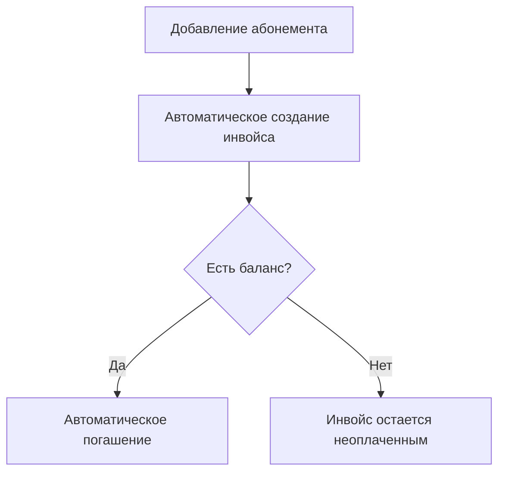
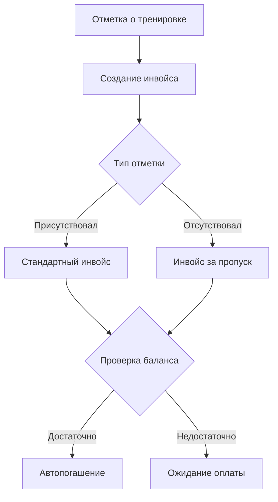
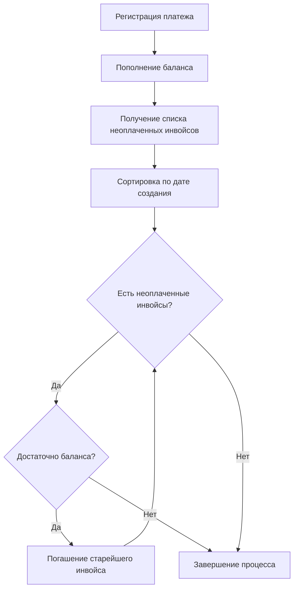
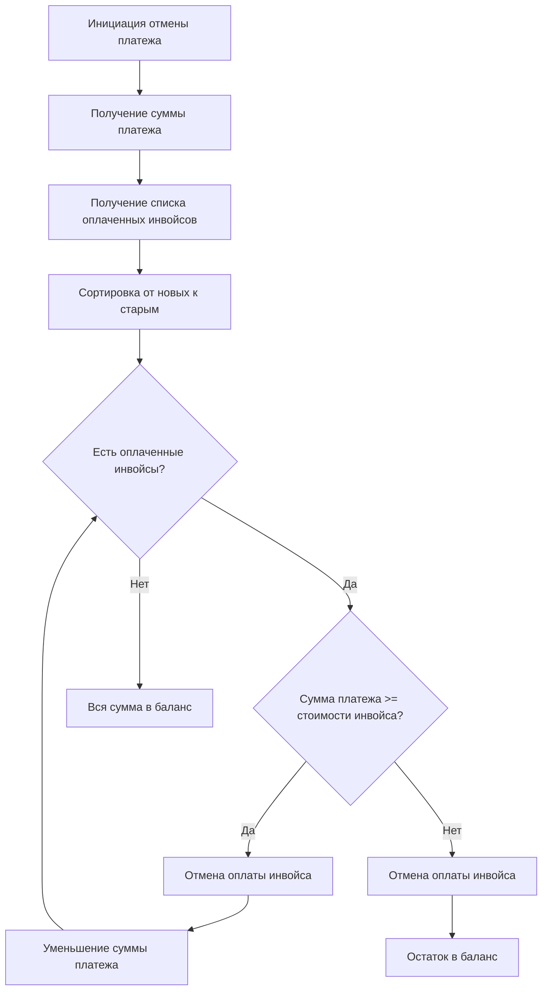

# Автоматические финансовые процессы

## Триггеры создания инвойсов

### 1. Добавление абонемента


#### Процесс
1. Тренер/админ добавляет абонемент студенту
2. Система автоматически создает инвойс
3. Проверяется баланс клиента
4. При достаточном балансе - автоматическое погашение
5. При недостаточном балансе - инвойс остается неоплаченным

### 2. Отметка о посещении/пропуске тренировки


#### Процесс
1. Тренер отмечает присутствие/отсутствие
2. Система создает инвойс независимо от типа отметки
3. Проверяется баланс клиента
4. При достаточном балансе - автоматическое погашение
5. При недостаточном балансе - инвойс остается неоплаченным

## Процесс погашения инвойсов

### Автоматическое погашение при пополнении баланса


#### Процесс
1. Регистрация платежа
2. Мгновенное пополнение баланса клиента
3. Получение списка всех неоплаченных инвойсов клиента
4. Сортировка инвойсов по дате создания (от старых к новым)
5. Последовательное погашение инвойсов пока:
   - Есть неоплаченные инвойсы
   - Достаточно средств на балансе

## Процесс отмены платежей

### Общий принцип отмены
- При обнаружении ошибки в платеже необходимо его полностью отменить
- После отмены вносится новый корректный платеж
- Частичная отмена платежа не допускается

### Алгоритм отмены платежа


#### Процесс отмены
1. Администратор инициирует отмену платежа
2. Система получает сумму отменяемого платежа
3. Формируется список оплаченных инвойсов в обратном порядке (от новых к старым)
4. Для каждого инвойса:
   - Если сумма платежа >= стоимости инвойса:
     * Отменяется оплата инвойса
     * Сумма платежа уменьшается на стоимость инвойса
   - Если сумма платежа < стоимости инвойса:
     * Отменяется оплата инвойса
     * Остаток зачисляется в баланс клиента
5. Если после обработки всех инвойсов остается сумма:
   - Она зачисляется в баланс клиента

### Пример процесса отмены
```
Исходные данные:
- Платеж на 5000р
- Оплаченные инвойсы (от новых к старым):
  * Инвойс 1: 2000р
  * Инвойс 2: 2000р
  * Инвойс 3: 500р
  * Инвойс 4: 1000р

Процесс отмены:
1. Отмена Инвойса 1 (2000р)
   Остаток платежа: 3000р
2. Отмена Инвойса 2 (2000р)
   Остаток платежа: 1000р
3. Отмена Инвойса 3 (500р)
   Остаток платежа: 500р
4. Инвойс 4 не отменяется
   Остаток 500р идет в баланс
```

### Правила и ограничения отмены

#### Права доступа
- Отмена платежей доступна только администраторам
- Система протоколирует все действия по отмене
- Требуется указание причины отмены

#### Ограничения процесса
- Нельзя отменить часть платежа
- Отмена всегда идет от новых инвойсов к старым
- При невозможности отменить инвойс целиком, остаток идет в баланс

#### Технические аспекты
- Процесс отмены выполняется в одной транзакции
- Все этапы отмены логируются
- Система создает уведомления о каждом этапе
- История операций сохраняется для аудита

### Последствия отмены

#### Для инвойсов
- Инвойсы возвращаются в статус "Неоплачен"
- Сохраняется история оплаты и отмены
- Инвойсы могут быть оплачены повторно

#### Для баланса
- Остаток от отмены добавляется к балансу
- Система пересчитывает доступные средства
- Возможно автоматическое погашение других инвойсов

#### Для отчетности
- Отмененные операции помечаются в отчетах
- Создаются корректировочные документы
- Обновляется финансовая статистика

## Правила и ограничения

### Создание инвойсов
- Инвойсы создаются автоматически системой
- Каждый инвойс привязан к конкретному событию (абонемент/тренировка)
- Система всегда пытается погасить инвойс сразу после создания

### Погашение инвойсов
- Строгий порядок погашения: от старых к новым
- Частичное погашение инвойсов не допускается
- Погашение происходит автоматически при достаточном балансе

### Платежи
- Моментальное пополнение баланса
- Автоматический запуск процесса погашения инвойсов
- Сохранение истории операций

## Технические требования

### Атомарность операций
- Создание инвойса и проверка баланса - одна транзакция
- Погашение инвойса и списание средств - одна транзакция
- Пополнение баланса и погашение инвойсов - одна транзакция

### Очередность операций
- Строгая последовательность обработки платежей
- Гарантированная очередность погашения инвойсов
- Логирование всех этапов процесса

### Обработка ошибок
- Откат транзакций при ошибках
- Сохранение состояния до и после операций
- Уведомление администраторов о проблемах 