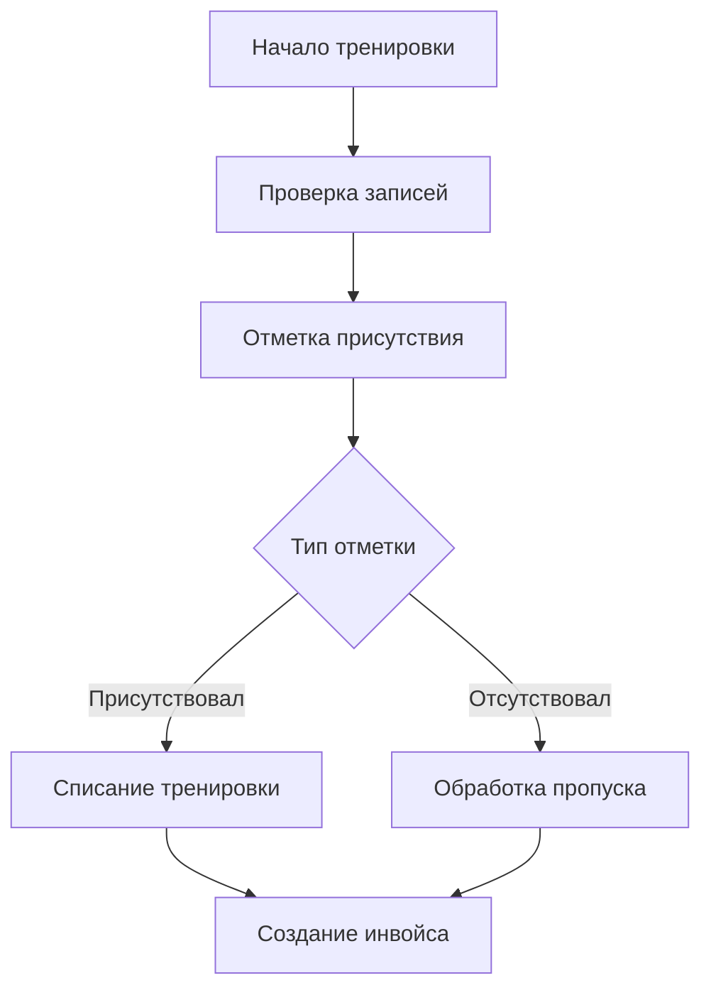

# Учет посещаемости

## Общее описание
Система учета посещаемости Atlantis обеспечивает контроль присутствия студентов на тренировках, обработку пропусков и компенсацию отмененных тренировок.

## Отметка присутствия

### Процесс отметки

### Статусы присутствия
- Присутствовал
- Отсутствовал

## Обработка пропусков

### Типы пропусков
1. С предварительным уведомлением
   - За 12 часов и более
   - Возможность переноса
   - Сохранение тренировки

2. Без уведомления
   - Списание тренировки
   - Без возможности переноса
   - Фиксация в истории

3. По вине школы
   - Автоматический возврат
   - Продление абонемента как описано в финансовых процессах

### Правила обработки
- Уведомление минимум за 12 часов
- Максимум 3 переноса в месяц
- Автоматическое списание при неявке
- Учет причины пропуска

## Компенсация отмененных тренировок

### Механизм компенсации
- Возврат тренировки в абонемент
- Продление срока действия
- Уведомление о компенсации

### Правила компенсации
- Только для отмен по вине школы

## Учет посещаемости

### Процесс учета
1. Проверка записей на тренировку
2. Отметка фактического присутствия
3. Обработка пропусков
4. Генерация отчета

### Статистика и отчеты
- Процент посещаемости
- История пропусков

## Технические аспекты

### Автоматизация процессов
- Автоматическое списание
- Генерация уведомлений
- Создание отчетов
- Автоматическое создание инвойсов по правилам финансовых процессов

### Контроль данных
- Валидация отметок
- Проверка дублей
- Сверка с расписанием

### Интеграция
- Связь с абонементами
- Синхронизация с расписанием
- Обновление статистики
- Отправка уведомлений
- Интеграция с финансовым модулем для создания инвойсов

## Правила и ограничения

### Основные правила
- Отметка только в день тренировки
- Контроль опозданий
- Учет предупреждений
- Ограничения на переносы

### Технические требования
- Атомарность операций
- Логирование действий
- Резервное копирование
- Защита от ошибок

### Доступ к данным
- Права тренеров
- Права администраторов
- История изменений
- Защита персональных данных 

#### Процесс создания инвойса
1. После фиксации статуса присутствия/отсутствия
2. Автоматическое создание инвойса для клиента
3. Применение правил из финансовых процессов:
   - Для присутствовавших студентов
   - Для отсутствовавших без уважительной причины
4. Интеграция с финансовым модулем
