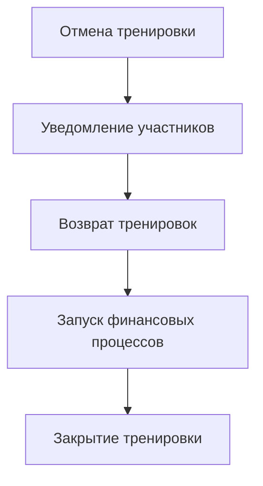

# Автоматические процессы управления тренировками

## Создание тренировок из расписания

### 1. Еженедельное создание тренировок
Процесс запускается автоматически раз в неделю (например, в ночь с воскресенья на понедельник) для создания реальных тренировок на предстоящую неделю на основе существующих шаблонов.

```mermaid
graph TD
    subgraph Легенда
        direction LR
        L1[Действие системы]
        L2{Условие/Фильтр}
        L3[/Результат/]
        L4((Начало/Конец))
        L5{{База данных}}
        L6(Логирование)
    end
    
    A((Начало)) --> B[Получить все<br>активные шаблоны];
    B --> C{Цикл по каждому шаблону};
    C --> D[Вычислить дату<br>тренировки на<br>следующей неделе];
    D --> E{{Получить всех студентов,<br>привязанных к шаблону}};
    E --> F{Фильтровать студентов:<br>1. !is_frozen<br>2. start_date <= дата тренировки};
    F --> G[Сортировать студентов<br>по start_date (ASC)];
    G --> H[Создать RealTraining];
    H --> I[Получить max_participants<br>из TrainingType];
    I --> J{Цикл по отсортированным<br>студентам};
    J --> K{Лимит участников<br>достигнут?};
    K -->|Нет| L[Добавить студента<br>в RealTraining];
    L --> J;
    K -->|Да| M(Записать Warning в лог:<br>студент не добавлен);
    M --> N[/Тренировка заполнена/];
    J -- Завершение цикла по студентам --> N;
    N --> C;
    C -- Завершение цикла по шаблонам --> Z((Конец));
```

#### Детализированный процесс
1.  **Триггер**: Процесс запускается автоматически по расписанию (например, еженедельно).
2.  **Получение шаблонов**: Система запрашивает из базы данных все активные `TrainingTemplate`.
3.  **Итерация по шаблонам**: Для каждого найденного шаблона выполняются следующие шаги.
4.  **Расчет даты**: Вычисляется конкретная дата предстоящей тренировки на основе дня недели, указанного в шаблоне (`template.day_number`).
5.  **Получение списка студентов**: Из `TrainingStudentTemplate` извлекаются все записи, связанные с текущим шаблоном.
6.  **Фильтрация студентов**: Список студентов фильтруется по двум ключевым условиям:
    - **Статус**: Учитываются только студенты, у которых не установлен флаг `is_frozen`.
    - **Дата начала**: Учитываются только те студенты, чья `start_date` в шаблоне меньше или равна вычисленной дате тренировки.
7.  **Сортировка (Приоритезация)**: Отфильтрованные студенты сортируются по дате начала (`start_date`) в порядке возрастания. Это гарантирует, что студенты, которые записались раньше, имеют приоритет при попадании в группу.
8.  **Создание реальной тренировки**: В базе данных создается запись `RealTraining` со всеми необходимыми данными (дата, тренер, тип и т.д.).
9.  **Наполнение группы**: Система итерируется по отсортированному списку студентов и добавляет их в созданную `RealTraining` один за другим, пока не будет достигнут лимит `max_participants`, указанный в `TrainingType`.
10. **Обработка переполнения**: Если студент из списка не может быть добавлен, потому что лимит участников уже достигнут, система **не добавляет** его, но создает **запись в логе** уровня `WARNING`. Эта запись содержит ID студента и ID тренировки, что позволяет администраторам отследить такие случаи.
11. **Завершение**: Процесс повторяется для всех шаблонов.

## Процесс обработки отмен

### Автоматическая обработка отмены тренировки


#### Процесс
1. Инициация отмены тренировки администратором
2. Мгновенное уведомление всех участников
3. Возврат тренировок в абонементы участников
4. Запуск связанных финансовых процессов
5. Закрытие тренировки

### Автоматическая обработка отмены участия
```mermaid
graph TD
    A[Запрос на отмену участия] --> B[Проверка времени до начала]
    B -->|≥ 12 часов| C[Полное удаление]
    B -->|< 12 часов| D[Статус "отсутствовал"]
    C --> E[Возврат в абонемент]
    D --> F[Списание тренировки]
    E --> G[Обновление истории]
    F --> G
```

#### Процесс
1. Получение запроса на отмену участия
2. Автоматическая проверка времени до начала тренировки
3. Принятие решения на основе 12-часового правила
4. Выполнение соответствующего действия:
   - ≥ 12 часов: удаление и возврат
   - < 12 часов: установка статуса
5. Обновление истории изменений
6. Уведомление участника о результате

## Правила и ограничения

### Создание тренировок
- Автоматический запуск каждое воскресенье в 21:00
- Создание только на следующую неделю
- Тренировки создаются на основе шаблонов расписания
- Автоматическое добавление участников по датам начала
- Проверка конфликтов для каждой тренировки

### Отмены и изменения
- Автоматическое уведомление всех участников
- Возврат тренировок в абонементы
- Запуск финансовых процессов при отмене
- Только администраторы могут отменять тренировки

## Технические требования

### Атомарность операций
- Создание тренировок и проверка конфликтов - одна транзакция
- Отмена тренировки и возврат в абонементы - одна транзакция
- Добавление участников из шаблона - одна транзакция

### Очередность операций
- Строгая последовательность создания тренировок
- Приоритетная обработка отмен
- Логирование всех этапов процесса

### Обработка ошибок
- Откат транзакций при ошибках
- Сохранение состояния до и после операций
- Уведомление администраторов о проблемах

### Уведомления
- Создание новых тренировок
- Конфликты при создании
- Отмена тренировок
- Изменение параметров тренировок 