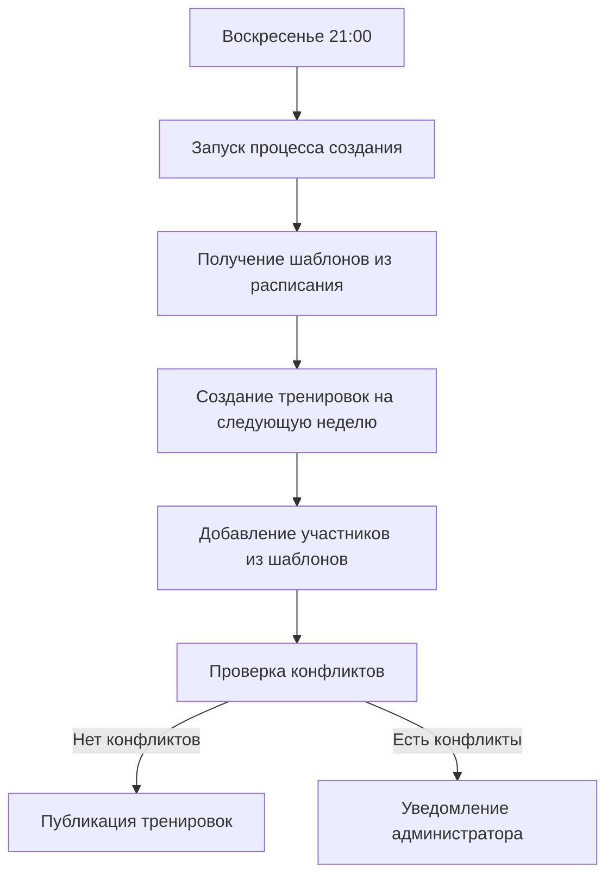
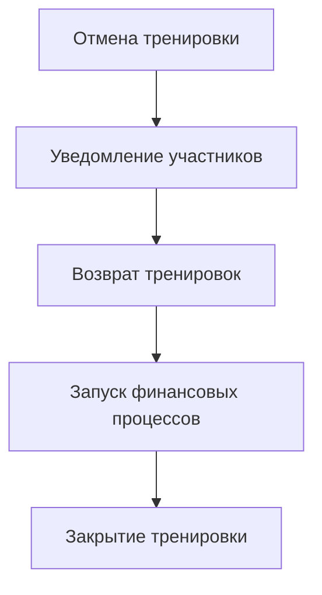

# Автоматические процессы управления тренировками

## Создание тренировок из расписания

### 1. Еженедельное создание тренировок


#### Процесс
1. Автоматический запуск каждое воскресенье в 21:00
2. Получение всех активных шаблонов из расписания
3. Создание тренировок на следующую неделю
4. Автоматическое добавление участников согласно датам начала
5. Проверка конфликтов по времени и тренерам
6. При отсутствии конфликтов - публикация тренировок
7. При наличии конфликтов - уведомление администратора

## Процесс обработки отмен

### Автоматическая обработка отмены тренировки


#### Процесс
1. Инициация отмены тренировки администратором
2. Мгновенное уведомление всех участников
3. Возврат тренировок в абонементы участников
4. Запуск связанных финансовых процессов
5. Закрытие тренировки

### Автоматическая обработка отмены участия
```mermaid
graph TD
    A[Запрос на отмену участия] --> B[Проверка времени до начала]
    B -->|≥ 12 часов| C[Полное удаление]
    B -->|< 12 часов| D[Статус "отсутствовал"]
    C --> E[Возврат в абонемент]
    D --> F[Списание тренировки]
    E --> G[Обновление истории]
    F --> G
```

#### Процесс
1. Получение запроса на отмену участия
2. Автоматическая проверка времени до начала тренировки
3. Принятие решения на основе 12-часового правила
4. Выполнение соответствующего действия:
   - ≥ 12 часов: удаление и возврат
   - < 12 часов: установка статуса
5. Обновление истории изменений
6. Уведомление участника о результате

## Правила и ограничения

### Создание тренировок
- Автоматический запуск каждое воскресенье в 21:00
- Создание только на следующую неделю
- Тренировки создаются на основе шаблонов расписания
- Автоматическое добавление участников по датам начала
- Проверка конфликтов для каждой тренировки

### Отмены и изменения
- Автоматическое уведомление всех участников
- Возврат тренировок в абонементы
- Запуск финансовых процессов при отмене
- Только администраторы могут отменять тренировки

## Технические требования

### Атомарность операций
- Создание тренировок и проверка конфликтов - одна транзакция
- Отмена тренировки и возврат в абонементы - одна транзакция
- Добавление участников из шаблона - одна транзакция

### Очередность операций
- Строгая последовательность создания тренировок
- Приоритетная обработка отмен
- Логирование всех этапов процесса

### Обработка ошибок
- Откат транзакций при ошибках
- Сохранение состояния до и после операций
- Уведомление администраторов о проблемах

### Уведомления
- Создание новых тренировок
- Конфликты при создании
- Отмена тренировок
- Изменение параметров тренировок 