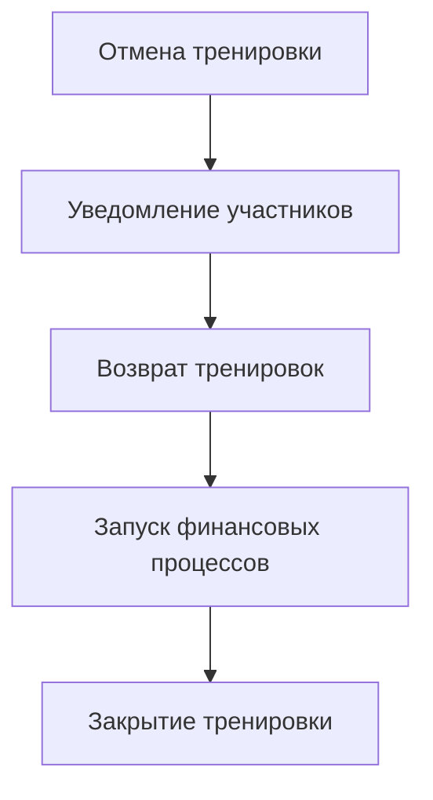
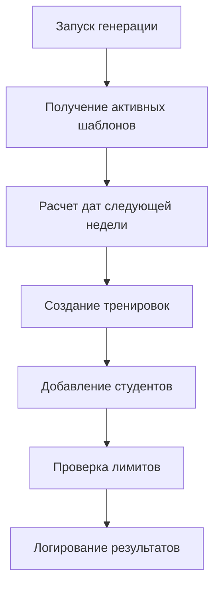
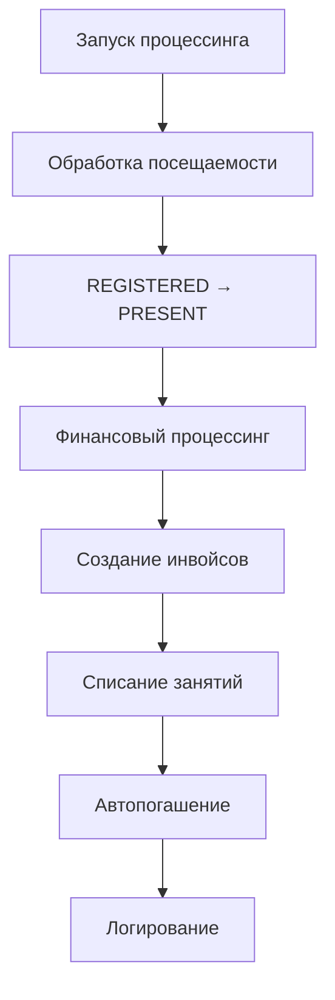
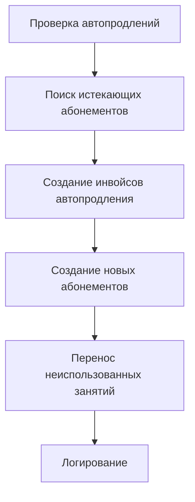
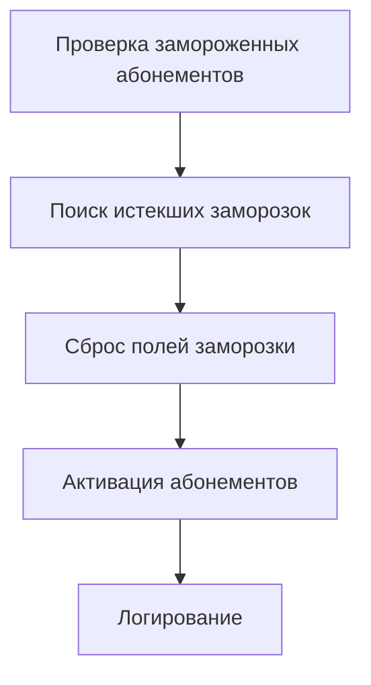

# Автоматические процессы управления тренировками

## Создание тренировок из расписания

### 1. Еженедельное создание тренировок
Процесс запускается автоматически раз в неделю (например, в ночь с воскресенья на понедельник) для создания реальных тренировок на предстоящую неделю на основе существующих шаблонов.

```mermaid
graph TD
    subgraph Легенда
        direction LR
        L1[Действие системы]
        L2{Условие/Фильтр}
        L3[/Результат/]
        L4((Начало/Конец))
        L5{{База данных}}
        L6(Логирование)
    end
    
    A((Начало)) --> B[Получить все<br>активные шаблоны];
    B --> C{Цикл по каждому шаблону};
    C --> D[Вычислить дату<br>тренировки на<br>следующей неделе];
    D --> E{{Получить всех студентов,<br>привязанных к шаблону}};
    E --> F{Фильтровать студентов:<br>1. !is_frozen<br>2. start_date <= дата тренировки};
    F --> G[Сортировать студентов<br>по start_date (ASC)];
    G --> H[Создать RealTraining];
    H --> I[Получить max_participants<br>из TrainingType];
    I --> J{Цикл по отсортированным<br>студентам};
    J --> K{Лимит участников<br>достигнут?};
    K -->|Нет| L[Добавить студента<br>в RealTraining];
    L --> J;
    K -->|Да| M(Записать Warning в лог:<br>студент не добавлен);
    M --> N[/Тренировка заполнена/];
    J -- Завершение цикла по студентам --> N;
    N --> C;
    C -- Завершение цикла по шаблонам --> Z((Конец));
```

#### Детализированный процесс
1.  **Триггер**: Процесс запускается автоматически по расписанию (например, еженедельно).
2.  **Получение шаблонов**: Система запрашивает из базы данных все активные `TrainingTemplate`.
3.  **Итерация по шаблонам**: Для каждого найденного шаблона выполняются следующие шаги.
4.  **Расчет даты**: Вычисляется конкретная дата предстоящей тренировки на основе дня недели, указанного в шаблоне (`template.day_number`).
5.  **Получение списка студентов**: Из `TrainingStudentTemplate` извлекаются все записи, связанные с текущим шаблоном.
6.  **Фильтрация студентов**: Список студентов фильтруется по двум ключевым условиям:
    - **Статус**: Учитываются только студенты, у которых не установлен флаг `is_frozen`.
    - **Дата начала**: Учитываются только те студенты, чья `start_date` в шаблоне меньше или равна вычисленной дате тренировки.
7.  **Сортировка (Приоритезация)**: Отфильтрованные студенты сортируются по дате начала (`start_date`) в порядке возрастания. Это гарантирует, что студенты, которые записались раньше, имеют приоритет при попадании в группу.
8.  **Создание реальной тренировки**: В базе данных создается запись `RealTraining` со всеми необходимыми данными (дата, тренер, тип и т.д.).
9.  **Наполнение группы**: Система итерируется по отсортированному списку студентов и добавляет их в созданную `RealTraining` один за другим, пока не будет достигнут лимит `max_participants`, указанный в `TrainingType`.
10. **Обработка переполнения**: Если студент из списка не может быть добавлен, потому что лимит участников уже достигнут, система **не добавляет** его, но создает **запись в логе** уровня `WARNING`. Эта запись содержит ID студента и ID тренировки, что позволяет администраторам отследить такие случаи.
11. **Завершение**: Процесс повторяется для всех шаблонов.

## Процесс обработки отмен

### Автоматическая обработка отмены тренировки


#### Процесс
1. Инициация отмены тренировки администратором
2. Мгновенное уведомление всех участников
3. Возврат тренировок в абонементы участников
4. Запуск связанных финансовых процессов
5. Закрытие тренировки

### Автоматическая обработка отмены участия
```mermaid
graph TD
    A[Запрос на отмену участия] --> B[Проверка времени до начала]
    B -->|≥ 12 часов| C[Полное удаление]
    B -->|< 12 часов| D[Статус "отсутствовал"]
    C --> E[Возврат в абонемент]
    D --> F[Списание тренировки]
    E --> G[Обновление истории]
    F --> G
```

#### Процесс
1. Получение запроса на отмену участия
2. Автоматическая проверка времени до начала тренировки
3. Принятие решения на основе 12-часового правила
4. Выполнение соответствующего действия:
   - ≥ 12 часов: удаление и возврат
   - < 12 часов: установка статуса
5. Обновление истории изменений
6. Уведомление участника о результате

## Правила и ограничения

### Создание тренировок
- Автоматический запуск каждое воскресенье в 21:00
- Создание только на следующую неделю
- Тренировки создаются на основе шаблонов расписания
- Автоматическое добавление участников по датам начала
- Проверка конфликтов для каждой тренировки

### Отмены и изменения
- Автоматическое уведомление всех участников
- Возврат тренировок в абонементы
- Запуск финансовых процессов при отмене
- Только администраторы могут отменять тренировки

## Технические требования

### Атомарность операций
- Создание тренировок и проверка конфликтов - одна транзакция
- Отмена тренировки и возврат в абонементы - одна транзакция
- Добавление участников из шаблона - одна транзакция

### Очередность операций
- Строгая последовательность создания тренировок
- Приоритетная обработка отмен
- Логирование всех этапов процесса

### Обработка ошибок
- Откат транзакций при ошибках
- Сохранение состояния до и после операций
- Уведомление администраторов о проблемах

### Уведомления
- Создание новых тренировок
- Конфликты при создании
- Отмена тренировок
- Изменение параметров тренировок

---

# Полная система автоматических процессов Atlantis

## Обзор всех автоматических процессов

Система Atlantis включает комплекс автоматических процессов, которые обеспечивают бесперебойную работу фитнес-центра. Все процессы выполняются по расписанию и защищены API ключами.

## Расписание автоматических процессов

| Время | Процесс | Описание |
|-------|---------|----------|
| **21:00** | Генерация тренировок | Создание тренировок на следующую неделю |
| **23:00** | Ежедневный процессинг | Обработка посещаемости + финансы |

## 1. Генерация тренировок (21:00)

### Эндпоинт
```http
POST /real-trainings/generate-next-week
X-API-Key: <your-secure-api-key>
```

### Процесс


### Результат
```json
{
  "message": "Успешно сгенерировано 15 тренировок",
  "created_count": 15,
  "trainings": [...],
  "period": {
    "start": "2024-01-15",
    "end": "2024-01-21"
  }
}
```

## 2. Ежедневный процессинг (23:00)

### Эндпоинт
```http
POST /real-trainings/process-daily-operations
X-API-Key: <your-secure-api-key>
```

### Процесс


### Подпроцессы

#### 2.1 Обработка посещаемости (сегодняшние тренировки)
- Найти все тренировки за сегодня
- Для студентов со статусом `REGISTERED`:
  - Изменить статус на `PRESENT`
  - Установить время отметки
  - **НЕ списывать занятия** (это делается в финансовом процессинге)

#### 2.2 Финансовый процессинг (завтрашние тренировки)
- Найти все тренировки на завтра
- Для каждого студента:
  - Проверить наличие активного абонемента
  - Если есть абонемент: списать занятие
  - Если нет абонемента: создать инвойс
  - Попытаться автопогасить инвойс

### Результат
```json
{
  "timestamp": "2024-01-15T23:00:00",
  "attendance_processing": {
    "trainings_processed": 5,
    "students_marked_present": 23,
    "sessions_deducted": 0
  },
  "finance_processing": {
    "trainings_processed": 6,
    "invoices_created": 8,
    "sessions_deducted": 15,
    "auto_payments": 3
  },
  "message": "Ежедневный процессинг завершен"
}
```

## 3. Автопродление абонементов (ежедневно)

### Эндпоинт
```http
POST /cron/check-auto-renewals
X-API-Key: <your-secure-api-key>
```

### Процесс


### Логика
- Найти абонементы с `is_auto_renew = true`
- Проверить дату окончания (сегодня)
- Создать инвойс для автопродления
- Создать новый абонемент
- Перенести до 3 неиспользованных занятий

### Результат
```json
{
  "success": true,
  "renewals_processed": 5,
  "timestamp": "2024-01-15T23:00:00"
}
```

## 4. Авторазморозка абонементов (ежедневно)

### Эндпоинт
```http
POST /subscriptions/auto-unfreeze
X-API-Key: <your-secure-api-key>
```

### Процесс


### Логика
- Найти абонементы с `freeze_end_date < текущее_время`
- Сбросить `freeze_start_date` и `freeze_end_date`
- Активировать абонементы

### Результат
```json
[
  {
    "id": 1,
    "student_id": 123,
    "freeze_start_date": null,
    "freeze_end_date": null,
    "status": "active"
  }
]
```

## Мониторинг и история процессов

### Таблица истории процессов
```sql
CREATE TABLE automated_process_history (
    id SERIAL PRIMARY KEY,
    process_type VARCHAR NOT NULL,  -- 'attendance', 'finance', 'daily', 'auto_renewal', 'auto_unfreeze'
    process_date DATE NOT NULL,
    started_at TIMESTAMP NOT NULL,
    completed_at TIMESTAMP,
    status VARCHAR NOT NULL,        -- 'success', 'error', 'partial'
    
    -- Статистика
    trainings_processed INTEGER DEFAULT 0,
    students_processed INTEGER DEFAULT 0,
    sessions_deducted INTEGER DEFAULT 0,
    invoices_created INTEGER DEFAULT 0,
    errors_count INTEGER DEFAULT 0,
    
    -- Детали
    details JSON,
    error_message TEXT,
    
    -- Метаданные
    created_by VARCHAR DEFAULT 'system',
    api_key_used VARCHAR
);
```

### API для мониторинга
```http
GET /process-history?start_date=2024-01-08&end_date=2024-01-15
GET /process-history/{process_id}
GET /process-stats?period=week
```

## Настройка cron

### Пример cron задач
```bash
# Генерация тренировок (воскресенье 21:00)
0 21 * * 0 curl -X POST "http://localhost:8000/real-trainings/generate-next-week" \
  -H "X-API-Key: your-api-key"

# Ежедневный процессинг (каждый день 23:00)
0 23 * * * curl -X POST "http://localhost:8000/real-trainings/process-daily-operations" \
  -H "X-API-Key: your-api-key"

# Автопродление абонементов (каждый день 01:00)
0 1 * * * curl -X POST "http://localhost:8000/cron/check-auto-renewals" \
  -H "X-API-Key: your-api-key"

# Авторазморозка абонементов (каждый день 02:00)
0 2 * * * curl -X POST "http://localhost:8000/subscriptions/auto-unfreeze" \
  -H "X-API-Key: your-api-key"
```

## Безопасность

### API ключи
- Все автоматические процессы защищены API ключами
- Ключи передаются в заголовке `X-API-Key`
- Рекомендуется использовать разные ключи для разных процессов

### Логирование
- Все процессы логируются в `automated_process_history`
- Детальная информация сохраняется в поле `details`
- Ошибки записываются в `error_message`

### Мониторинг
- Статистика по процессам доступна через API
- Возможность настройки алертов при ошибках
- История всех автоматических операций

## Правила и ограничения

### Временные ограничения
- Процессы выполняются строго по расписанию
- Ручной запуск возможен только через API
- Дублирование процессов предотвращается

### Обработка ошибок
- При ошибке процесс останавливается
- Выполняется rollback транзакций
- Ошибка записывается в историю
- Администраторы уведомляются о проблемах

### Производительность
- Процессы оптимизированы для больших объемов данных
- Используются индексы для быстрого поиска
- Транзакции разбиваются на части при необходимости

### Масштабируемость
- Система поддерживает множество тренировок
- Процессы могут выполняться параллельно
- Возможность горизонтального масштабирования 