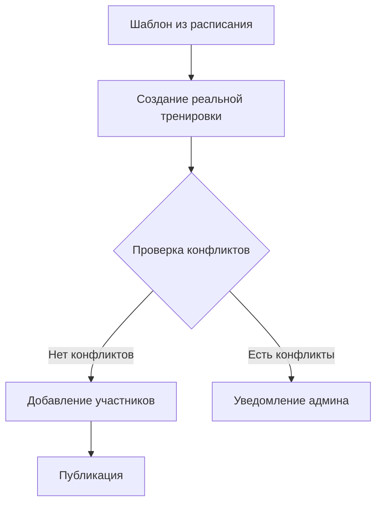
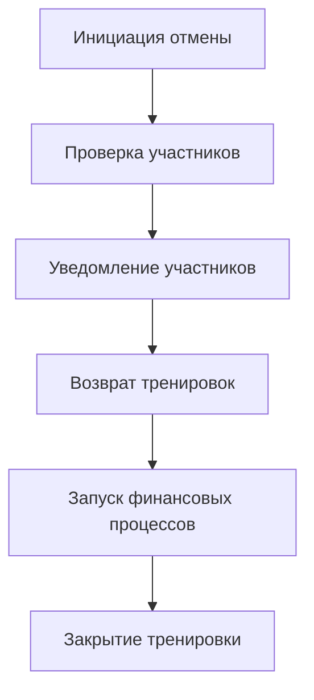

# Работа с тренировками

## Общее описание
Система управления тренировками Atlantis обеспечивает полный цикл работы с реальными тренировками, которые создаются на основе шаблонов из расписания. Включает управление записями, отменами и статусами участников.

## Создание тренировок

### Автоматическое создание

### Параметры тренировки
- Дата и время (1 час)
- Тренер
- Тип тренировки
- Статус тренировки (активна/отменена)
- Список участников и их статусы

## Управление участниками

### Процесс записи
1. Автоматическое добавление из шаблона расписания
2. Проверка абонемента
3. Подтверждение участия
4. Уведомление участника

### Отмена участия (только администраторами)
- По инициативе студента:
  * За 12 часов - безопасная отмена (полное удаление из тренировки)
  * Менее 12 часов - автоматическая отметка "отсутствовал"
- По инициативе школы:
  * Возврат тренировки
  * Запуск связанных финансовых процессов

## Отмена тренировок

### Процесс полной отмены (только администраторами)

### Правила отмены
- Полная отмена:
  * Только администраторами
  * Запуск финансовых процессов
  * Уведомление всех участников
  * Возврат тренировок в абонементы

- Отмена участия:
  * Только администраторами
  * За 12 часа - полное удаление
  * Менее 12 часов - статус "отсутствовал"
  * Автоматическое применение правил

## Статусы участников

### Типы статусов
- Присутствовал
- Отсутствовал (автоматически при поздней отмене)

### Правила изменения статусов
- Автоматическое проставление при отмене
- Ручное изменение только тренером
- Влияние на финансовые процессы
- Автоматическое создание инвойса после изменения статуса:
  * При отметке присутствия
  * При фиксации отсутствия
  * Согласно правилам финансовых процессов

## Технические аспекты

### Создание тренировок
- Наследование параметров из шаблона
- Проверка конфликтов
- Автоматическое добавление участников
- Валидация всех параметров

### Управление отменами
- Атомарность операций отмены
- Автоматическое применение правил
- Интеграция с финансовыми процессами:
  * Создание инвойсов для клиентов
  * Учет статуса посещения
- Система уведомлений

### История изменений
- Логирование всех действий
- Сохранение причин отмены
- Фиксация времени уведомления
- Отслеживание статусов

## Правила и ограничения

### Основные правила
- Фиксированная длительность - 1 час
- Отмена участия за 12 часа
- Только администраторы могут отменять
- Автоматическое применение статусов

### Технические требования
- Атомарность операций
- Логирование действий
- Контроль прав доступа
- Интеграция с другими модулями

### Уведомления
- Создание тренировки
- Изменение параметров
- Отмена участия/тренировки
- Изменение статусов 